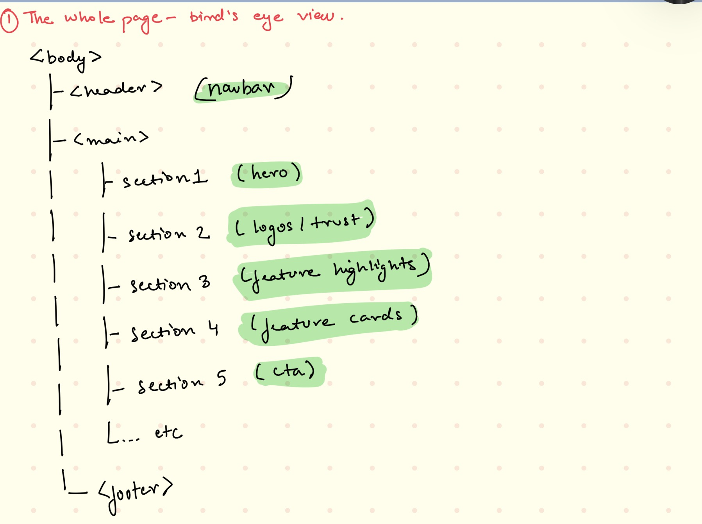
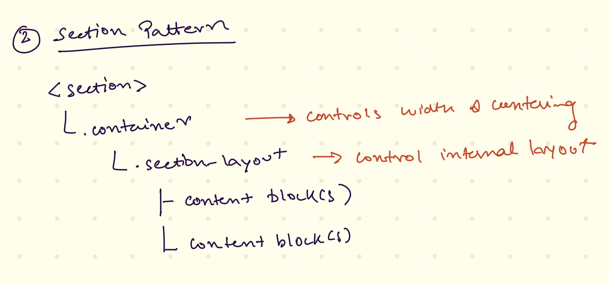
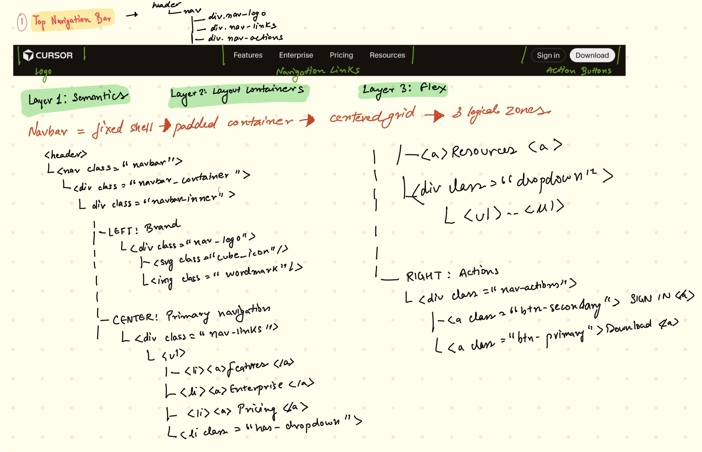
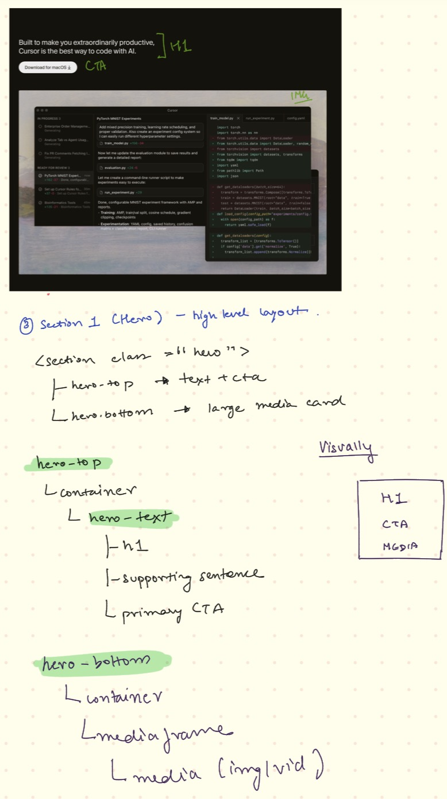
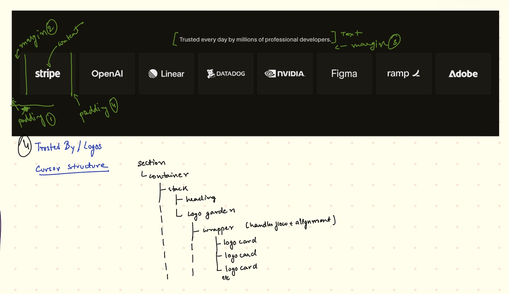
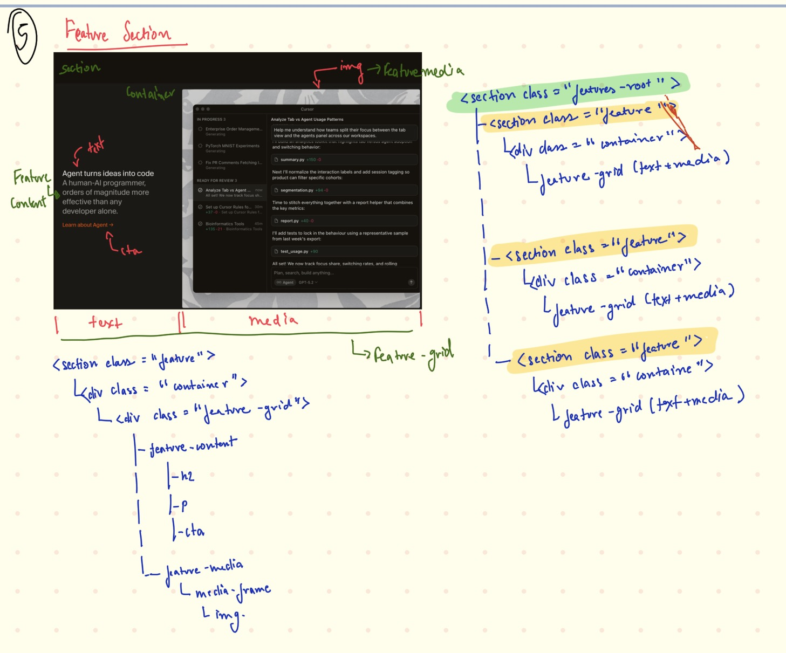
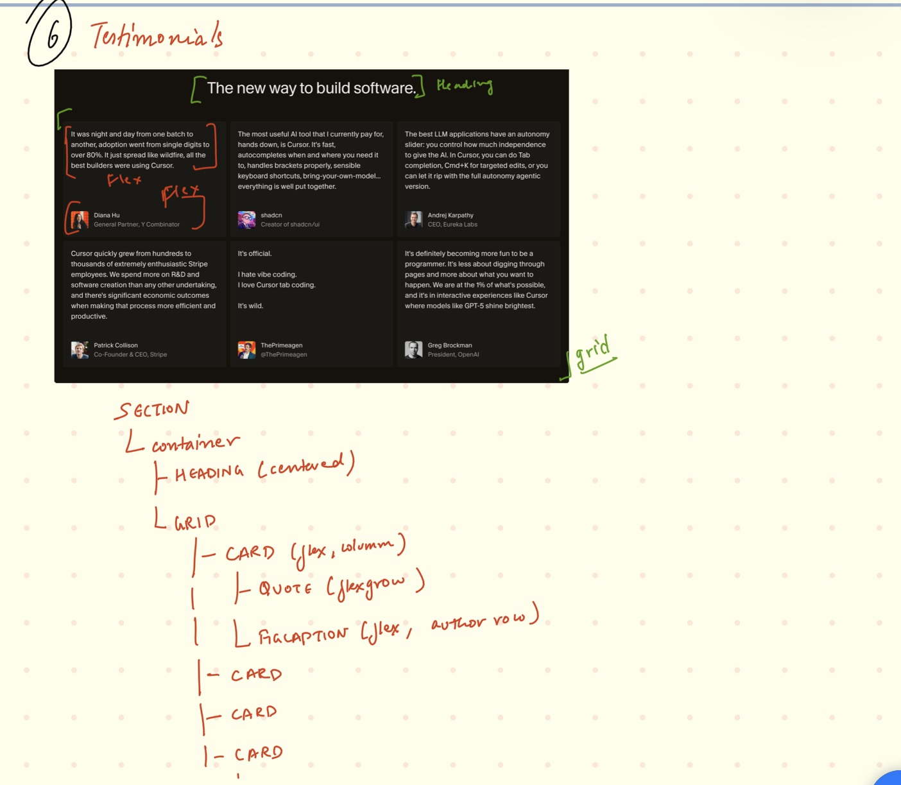
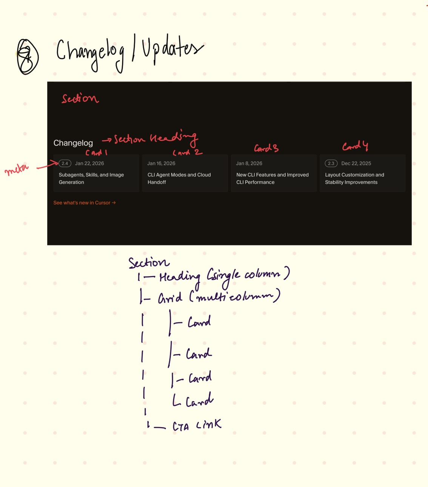
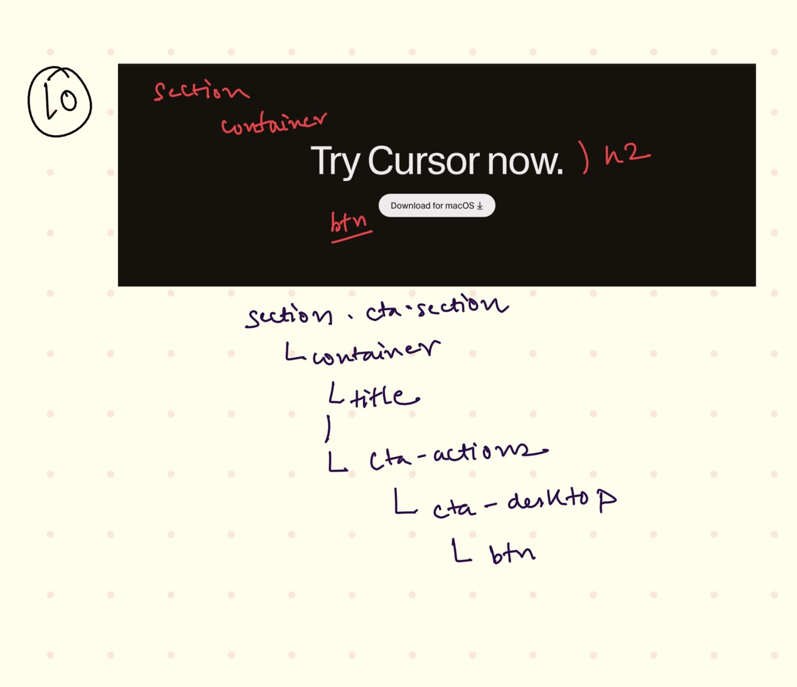
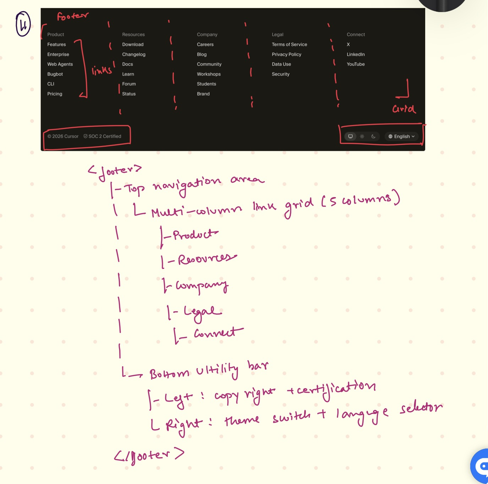

# Cursor- The best way to code with AI (Desktop-First)

This project recreates the **structure, layout logic, and visual hierarchy** of the Cursor website, focusing on **semantic HTML**, **clean layout patterns**, and **readability** rather than pixel-perfect cloning.

The goal is to demonstrate **layout thinking**, **component structure**, and **consistent section patterns** used in modern documentation and product sites.

# 🎯 Project Goals

- Desktop-first layout
- Strong semantic HTML structure
- Reusable section patterns
- Clear separation of structure and styling
- Structurally inspired by Cursor 

## 🧠 High-Level Page Structure (Bird’s-Eye View)

---

## 🧭 Navigation Bar Structure

---

## 🦸 Hero Section Layout

---

## ⭐ Trusted By / Logos

---

## 🧩 Feature Sections (3 blocks)

---

## 💬 Testimonials Section

---

## 🚀 Use Cases / Stories (“Stay on the frontier”)

---

## 📰 Changelog / Updates

---

## 🕒 Recent Highlights

---

## 📎 Call To Action (CTA)

---

## 🦶 Footer

---
## Whole Screenshot of the website

--
## 🎨 Fonts & Colors Used

This project uses a **token-based design system** inspired by Cursor’s documentation UI, with a strong focus on readability, hierarchy, and consistency.

## 🔤 Typography (Fonts)
*Primary Font Family*
"Inter", system-ui, -apple-system, BlinkMacSystemFont,
"Segoe UI", "Helvetica Neue", Helvetica, Arial, sans-serif

### Font Weights

| Usage           | Weight |
|-----------------|--------|
| Headings        | 400    |
| Body text       | 400    |
| UI labels       | 400    |
| Buttons / Links | 400    |

> This project intentionally uses a single font weight (400) across all UI elements,
> matching Cursor’s minimalist and readability-first design philosophy.

## 🎨 Color Palette

>The UI uses a dark-first neutral palette, optimized for long reading sessions and reduced visual fatigue.

## 🌑 Background Colors

| Token	                 | Color       |
|------------------------|-------------|
| --bg-page              | #14120b   |
| --bg-navbar            | #15140e   |
| --bg-dropdown          | #1a170f   |
| --color-theme-card-hex | #1b1913   |

---

## 📝 Text Colors

| Token                    | Color                                 | 
| ------------------------ | ------------------------------------- | 
| `--text-primary`         | #dadcdf                             | 
| `--text-hover`           | #ffffff                              | 
| `--text-muted`           | #8b8d91                             | 
| `--color-theme-text-sec` | color-mix(#edecec 60%, transparent)   | 

---

## 🧱 Borders, Radius & UI Tokens

| Token             | Value                    | 
| ----------------- | ------------------------ |
| `--radius-xs`     | `4px`                    | 
| `--radius-sm`     | `6px`                    | 
| `--radius-md`     | `8px`                    | 
| `--radius-full`   | `999px`                  | 

---

## 📌 Notes for Evaluators

- Focus is on structure and layout logic
- CSS is intentionally minimal and reusable
- No external JS frameworks
- Inspired by Cursor, not copied

---

## ✅ What This Demonstrates

- Semantic HTML mastery
- Layout thinking (grid vs flex)
- Real-world product site patterns
- Scalable architecture

---
## 👤 Author
**Sneha Kumari**  